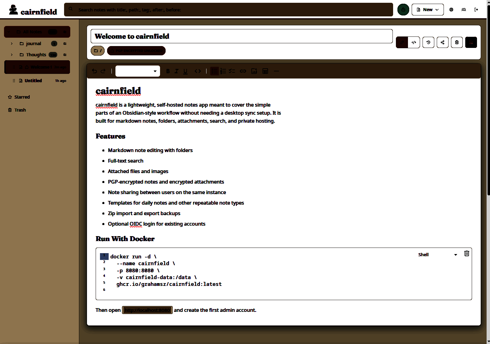

# cairnfield

cairnfield is a lightweight, self-hosted notes app meant to cover the simple
parts of an Obsidian-style workflow without needing a desktop sync setup. It is
built for markdown notes, folders, attachments, search, and private hosting.



## Features

- Markdown note editing with folders
- Full-text search
- Attached files and images
- PGP-encrypted notes and encrypted attachments
- Note sharing between users on the same instance
- Templates for daily notes and other repeatable note types
- Zip import and export backups (with full restore)
- Offline-capable PWA and Android app
- Browser web-clipper extension
- Optional OIDC login for existing accounts

## Run With Docker

```sh
docker run -d \
  --name cairnfield \
  -p 8080:8080 \
  -v cairnfield-data:/data \
  ghcr.io/grahamsz/cairnfield:latest
```

Then open `http://localhost:8080` and create the first admin account.

## Run Under a Subfolder

By default cairnfield serves at the domain root, such as `https://notes.example.com/`.
To serve it below a path prefix, set `CAIRNFIELD_BASE_PATH` to that prefix.
Your reverse proxy can either preserve that prefix when forwarding to cairnfield
or strip it before forwarding; cairnfield will generate prefixed public URLs in
both cases.

Example for `https://example.com/cairnfield/`:

```sh
docker run -d \
  --name cairnfield \
  -p 8080:8080 \
  -v cairnfield-data:/data \
  -e CAIRNFIELD_BASE_PATH="/cairnfield" \
  ghcr.io/grahamsz/cairnfield:latest
```

With this setting, the UI, API, assets, service worker, cookies, generated
attachment links, backup links, and client-side note/search routes all live
under `/cairnfield`.

## Android App

A native Android companion app (a WebView shell with offline support and
self-updates) is built from this repository. Download
`cairnfield-android.apk` from the latest
[GitHub release](https://github.com/grahamsz/cairnfield/releases/latest),
install it, and enter your server URL. The app checks GitHub releases daily
and offers to update itself when a new version is tagged. Building and signing
your own is documented in [docs/android.md](docs/android.md).

## OIDC Login

cairnfield can show an OIDC sign-in button on the login page. OIDC login only
signs in existing cairnfield users; it does not create accounts automatically.
Create the user in cairnfield first with the same email address that the OIDC
provider returns.

Configure your OIDC provider with this redirect URI:

```text
https://your-cairnfield-host.example/api/oidc/callback
```

If you use `CAIRNFIELD_BASE_PATH`, include the prefix:

```text
https://your-cairnfield-host.example/cairnfield/api/oidc/callback
```

For local testing, use the matching local callback URL:

```text
http://localhost:8080/api/oidc/callback
```

Set these environment variables when starting cairnfield:

| Variable | Required | Description |
| --- | --- | --- |
| `CAIRNFIELD_OIDC_ISSUER` | Yes | OIDC issuer URL, such as `https://accounts.google.com` or your provider's issuer URL. |
| `CAIRNFIELD_OIDC_CLIENT_ID` | Yes | Client ID from the OIDC provider. |
| `CAIRNFIELD_OIDC_CLIENT_SECRET` | Yes | Client secret from the OIDC provider. |
| `CAIRNFIELD_OIDC_REDIRECT_URL` | No | Explicit callback URL. If omitted, cairnfield derives `/api/oidc/callback` from the incoming request. Set this when running behind a proxy that does not preserve the public scheme or host. |
| `CAIRNFIELD_OIDC_SCOPES` | No | Space-separated scopes. Defaults to `openid email profile`. |
| `CAIRNFIELD_OIDC_NAME` | No | Label shown on the login button. Defaults to `OIDC`. |
| `CAIRNFIELD_OIDC_ALLOWED_EMAILS` | No | Comma-separated allowlist of email addresses. If set, only these emails can sign in. |
| `CAIRNFIELD_OIDC_ALLOWED_DOMAINS` | No | Comma-separated allowlist of email domains. If set, only users from these domains can sign in. |

Example:

```sh
docker run -d \
  --name cairnfield \
  -p 8080:8080 \
  -v cairnfield-data:/data \
  -e CAIRNFIELD_OIDC_ISSUER="https://accounts.example.com" \
  -e CAIRNFIELD_OIDC_CLIENT_ID="cairnfield" \
  -e CAIRNFIELD_OIDC_CLIENT_SECRET="change-me" \
  -e CAIRNFIELD_OIDC_REDIRECT_URL="https://notes.example.com/api/oidc/callback" \
  -e CAIRNFIELD_OIDC_NAME="ExampleID" \
  ghcr.io/grahamsz/cairnfield:latest
```

When OIDC is configured, cairnfield advertises the provider in the login view.
After the provider redirects back, cairnfield verifies the ID token, requires a
verified email address, checks the optional allowlists, then signs in the local
user whose email matches the OIDC email.

## Documentation

Developer documentation lives in [docs/](docs/README.md): architecture and
data model, the HTTP API, the frontend, the browser extension, and the
project's relationship to rolltop.

## License

cairnfield is licensed under the GNU Affero General Public License v3.0 only.
See [LICENSE](LICENSE).
